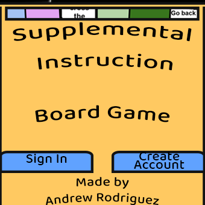

# Full-Stack Exam Review Application

    
**SI Board Game**
 
Author: **Andrew Rodriguez**
---
### Table of Contents
- [Description](#description)
- [How To Use](#how-to-use)
- [Video Walkthrough](#video-walkthrough)
- [User Stories](#user-stories)
- [Author Info](#author-info)
---
## Description
**SI Board Game is a Unity WebGL game that allows Supplemental Instruction leaders to gamify their exam reviews remotely by logging user data and simulating peronalized boards for study. Using Unity as the frontend with PHP and MySQL in the backend users data is persistant. Users can create and login using HTTPS-based user authentication with hashed passwords.
#### Technologies
- C#
- PHP
- Unity
- Google Cloud Platform
- MySQL
---
## How to use

---
## Video Walkthrough

Here's a walkthrough of implemented user stories:

GIF created with [LiceCap](http://www.cockos.com/licecap/).
---
## User Stories

* [x] User can **Create a unique account with hashed passwords and an email** to recieve confirmation codes
* [x] User can **Login with their account** from the login page
* [x] User can **Update account password** by recieving a reset email
* [x] User can **Create and save** up to 3 personalized study boards
* [x] User can **reopen saved** study boards
* [x] User can **Edit** the study board by inserting questions, and images.
* [x] User can **Play** their study board game.
---
## Challenges

---
## Author Info
- Linkedin - [@andrew-m-rodriguez](https://www.linkedin.com/in/andrew-m-rodriguez)
- Website - [andrewthedev](https://www.andrewthedev.com/)

## License

    Copyright [yyyy] [name of copyright owner]

    Licensed under the Apache License, Version 2.0 (the "License");
    you may not use this file except in compliance with the License.
    You may obtain a copy of the License at

        http://www.apache.org/licenses/LICENSE-2.0

    Unless required by applicable law or agreed to in writing, software
    distributed under the License is distributed on an "AS IS" BASIS,
    WITHOUT WARRANTIES OR CONDITIONS OF ANY KIND, either express or implied.
    See the License for the specific language governing permissions and
    limitations under the License.
